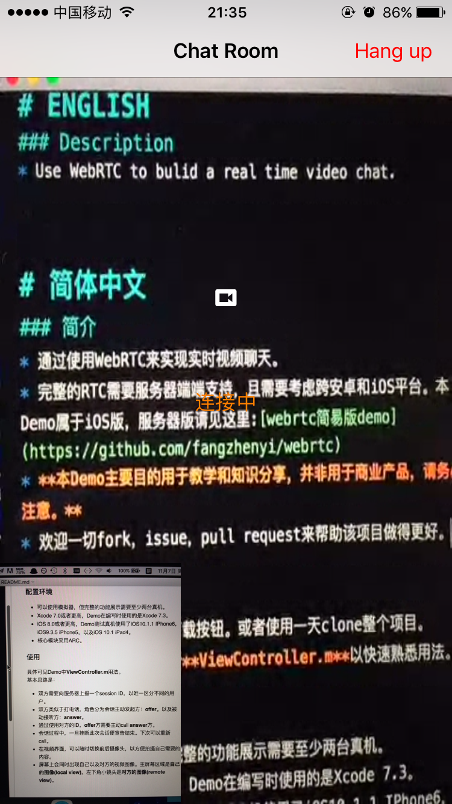
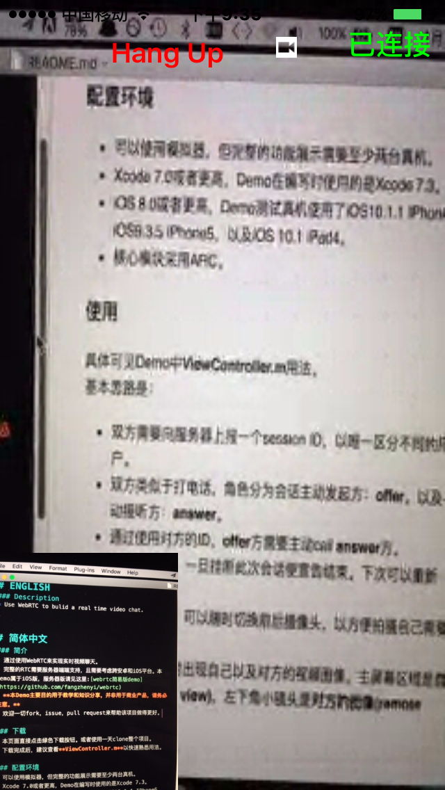

RTC_FaceChat
----------------------------------
# Demo Display

 
Gif 说明：左下角的黑屏是由于使用了Mac模拟器，无法启用摄像头。Gif演示了一系列无限的镜像。  
Gif demonstration: In iOS simulator, we can not open camera. Gif shows infinite mirror images.

# ENGLISH
### Description
* Use WebRTC to bulid a real time video chat.

### Download
* Directly download in this page or git clone the all project.

### Requirements
* Xcode 7.0 or higher
* iOS 8.0 or higher
* Most are in ARC

### Usegae
Excuse my English.   
Maybe you can get sth from my blog: [如何使用WebRTC实现视频聊天](http://kimihe.com/2016/11/07/%E5%A6%82%E4%BD%95%E4%BD%BF%E7%94%A8WebRTC%E5%AE%9E%E7%8E%B0%E8%A7%86%E9%A2%91%E8%81%8A%E5%A4%A9/).

### Contributing
Any fork, issues or pull requests are welcome. Let's improve together and help to make this repo better.

# 简体中文
### 简介
核心代码源自半年前的一个项目，现加以分享，会持续修改，以确保代码整洁高效。我必须坦言：现有的部分代码存在质量问题。

* 通过使用WebRTC来实现**实时视频聊天**。  
* 完整的RTC需要服务器端的支持，且需要考虑跨安卓和iOS平台。本Demo属于iOS版，服务器版请见这里:[webrtc简易版demo](https://github.com/fangzhenyi/webrtc)。
* **本Demo主要目的用于教学和知识分享，并非用于商业产品，请务必注意。**
* 欢迎一切fork，issue，pull request来帮助该项目做得更好。

### 下载
* 本页面直接点击绿色下载按钮。或者使用 git clone 整个项目。
* 下载完成后，建议查看**ViewController.m**以快速熟悉用法。

### 环境需求
* 可以使用模拟器，但完整的功能展示需要至少两台真机。
* Xcode 7.0或者更高，Demo在编写时使用的是Xcode 7.3。
* iOS 8.0或者更高，Demo测试真机使用了iOS10.1.1 IPhone6，iOS9.3.5 iPhone5，以及iOS 10.1 iPad4。
* 核心模块采用ARC。

### 使用
具体可见Demo中**ViewController.m**用法。详细讲解可见博客[如何使用WebRTC实现视频聊天](http://kimihe.com/2016/11/07/%E5%A6%82%E4%BD%95%E4%BD%BF%E7%94%A8WebRTC%E5%AE%9E%E7%8E%B0%E8%A7%86%E9%A2%91%E8%81%8A%E5%A4%A9/)。  
简要思路是：

* 双方需要向服务器上报一个**session ID**，以唯一区分不同的用户。
* 双方类似于打电话，角色分为会话主动发起方：**offer**。以及被动接听方：**answer**。
* 通过使用对方的ID，**offer**方需要主动call **answer**方。
* 会话过程中，一旦挂断此次会话便宣告结束。下次可以重新call。
* 在视频界面，可以随时切换前后摄像头，以方便拍摄自己需要的内容。
* 屏幕上会同时出现自己以及对方的视频图像。主屏幕区域是**对方拍摄的图像(remote view)**，左下角小镜头是**自己拍摄的图像(local view)**。

### 共享&进步
欢迎提出任何改进意见和建议，共同学习，把项目做得更好。
